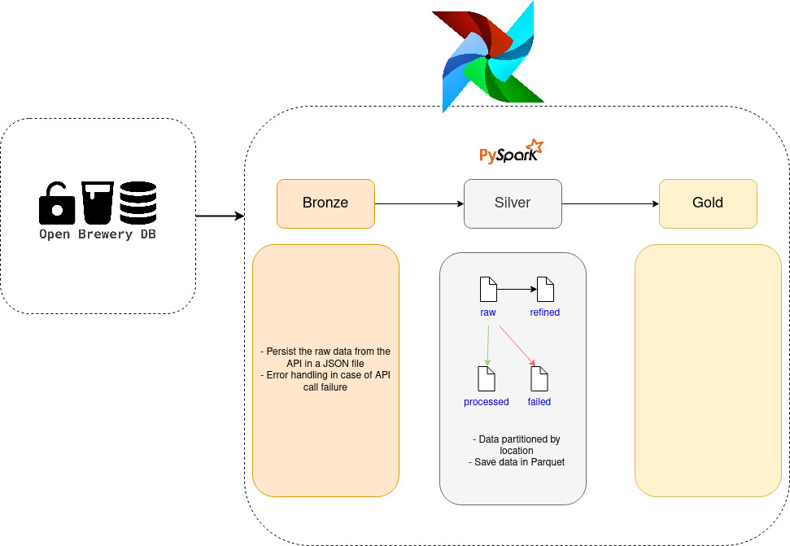
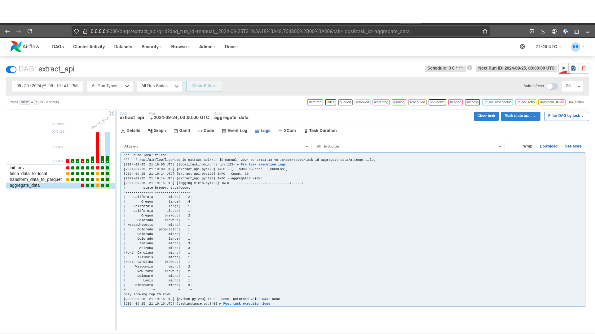

# breweries-datalake
This project focuses on building a data pipeline that ingests raw data from an API, transforms it into structured formats, and creates aggregated insights. The pipeline is designed with a three-layer architecture to ensure data integrity, efficient processing, and scalable analytics

The diagram below illustrates the datalake architecture, higlighting the bronze, silver, and gold layer.


## Init project
```
echo -e "AIRFLOW_UID=$(id -u)" > .env
```
Building the Docker image
```
docker build
```

Initializing the database and then running airflow
```
docker compose up airflow-init
docker compose up
```

## Running the DAG 

Access https://localhost:8080 and enter `airflow` as username and password.

Next, navigate to the DAG page and click the play button to trigger the pipeline execution. Check the logs to monitor the process and verify the details of the execution.


## Monitoring 
Here are some actions that should be implemented in this project:

### Quality checks
- Ensure that incoming data adheres to the expected schema by validating key columns, types, and formats.
- Add checks for null or missing values in critical fields, which could indicate upstream data issues.
- Monitor the volume of data ingested each day. Sudden drops or spikes could signal an issue with the API or data transformation steps.
- Look out for duplicate records during the ingestion or transformation stages.

These could be easily implemented by adding checks using Python. Also, creating separate Airflow tasks that validate data after each step.

### Performance monitoring
- Track the execution time of each task. If any task starts taking significantly longer than usual, that could indicate a performance bottleneck.
- Monitor system resources such as CPU, memory, and disk I/O. If the pipeline starts to approach system limits, it might be necessary to optimize tasks or scale infrastructure.

Airflow provides task duration metrics, but for more detailed insights, we could integrate with monitoring tools like Prometheus and Grafana, then being able to track trends. Additionally, setting up alerts so it's possible to investigate and act immediately.

## Next steps
- Error tracking using [Sentry](https://airflow.apache.org/docs/apache-airflow/stable/administration-and-deployment/logging-monitoring/errors.html)